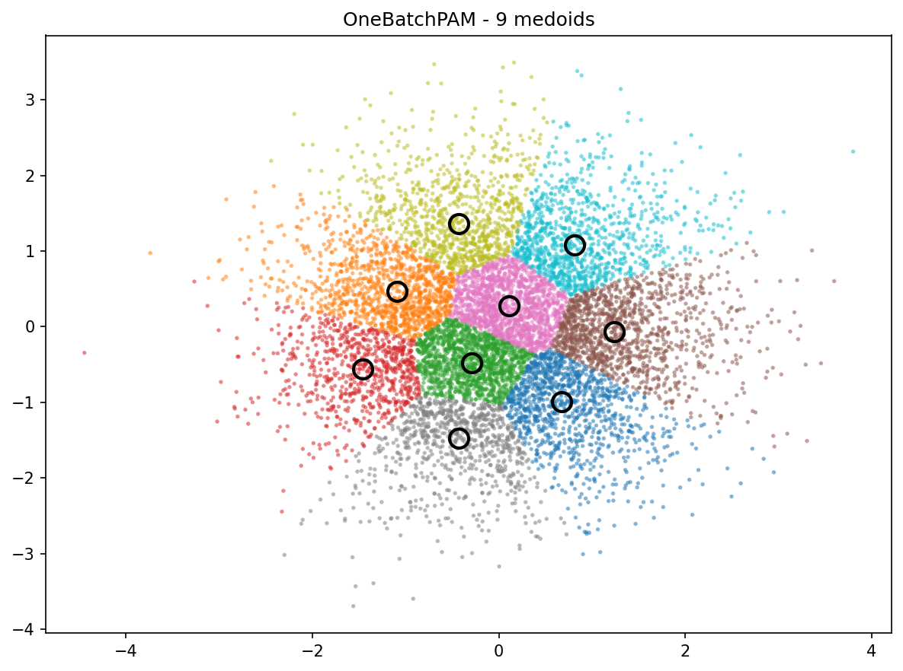

# OneBatchPAM

[](https://github.com/antoinedemathelin/onebatch/actions/workflows/ci.yml)
[](https://github.com/antoinedemathelin/onebatch)
[](https://pypi.org/project/onebatch/)
[](https://github.com/antoinedemathelin/onebatch)

Implementation of [OneBatchPAM: A Fast and Frugal K-Medoids Algorithm](https://arxiv.org/pdf/2501.19285) (AAAI 2025)

## Install the package:
```
pip install onebatch
```

## Minimal examples

From data:

```python
import numpy as np
from onebatch import OneBatchPAM

X = np.random.RandomState(0).randn(10000, 2).astype(np.float32)

km = OneBatchPAM(
    n_medoids=9,
    distance="euclidean",
    batch_size="auto",
    weighting=True,
    max_iter=100,
    tol=1e-6,
    n_jobs=None,
    random_state=0,
)

# Option 1: fit + attributes
km.fit(X)
medoids = km.medoid_indices_
labels = km.predict(X)  # or use km.labels_

# Option 2: fit_predict returns medoid indices
medoids2 = km.fit_predict(X)
```

From pre-computed distance matrix:
```python
import numpy as np
from sklearn.metrics import pairwise_distances
from onebatch import OneBatchPAM

X = np.random.RandomState(0).randn(10000, 2).astype(np.float32)

# Build a (n_samples, m) distance matrix to m candidate points
m = 1000
cand_idx = np.random.choice(X.shape[0], size=m, replace=False)
K = pairwise_distances(X, X[cand_idx], metric="euclidean")

km = OneBatchPAM(
    n_medoids=9,
    distance="precomputed",
    weighting=True,
    max_iter=100,
    tol=1e-6,
    random_state=0,
)

km.fit(K)
medoids = km.medoid_indices_
# Labels are available after fit via km.labels_
# Note: predict() is intended for feature-space distances; for precomputed, prefer km.labels_
```

For visualization:
```python
import matplotlib.pyplot as plt

plt.scatter(X[:, 0], X[:, 1], c=labels, cmap="tab10", s=3, alpha=0.4)
plt.plot(X[medoids, 0], X[medoids, 1], "ko", markersize=12, markeredgewidth=2, markerfacecolor="none")
plt.show()
```



## API notes
- **n_jobs**: number of parallel jobs for `sklearn.metrics.pairwise_distances`.
- **random_state**: `int` or `numpy.random.Generator` controlling sampling and initialization.
- **fit_predict**: returns medoid indices (not labels). After `fit`, labels are in `labels_`.
- **distance != 'precomputed'**: `batch_size` controls candidate columns; `'auto'` uses a heuristic.
- **distance == 'precomputed'**: pass a distance matrix of shape `(n_samples, m)` where each column contains distances to a candidate point. `batch_size` is ignored in this mode.
